## 1. 배경
기존 공공임대주택 입주의향을 분석한 연구들은 주거실태조사 문항 가운데 일부 변수에만 의존하는 경향이 있다. 구체적으로 인구사회학적 특성, 소득, 자산, 주거 특성 등 일반적으로 중요하다고 간주되어 온 변수들을 중심으로 분석이 이루어져 왔다. 이러한 접근은 설문조사에서 제공되는 다양한 정보를 충분히 활용하지 못한다는 한계를 가진다. 그 결과 실제로 입주의향을 설명하는 데 중요한 역할을 하는 항목들이 분석에서 간과되었다. 

또한 최근 도입된 통합공공임대주택 제도는 기준중위소득 상한이 150%까지 확대되면서 정책 대상 범위가 넓어졌음에도, 통합공공임대주택 정책 대상 가구를 대상으로 입주의향을 분석한 연구는 아직 이루어지지 않았다.

이러한 한계를 보완하고자, ① 설문조사에서 활용 가능한 문항들을 최대한 폭넓게 독립변수로 사용하여 기존 연구들에서 반복적으로 사용되어 온 변수들 외에 추가적으로 중요한 설명력을 가지는 항목들을 확인한다. ② 통합공공임대주택 정책 대상이라는 단일 집단을 분석하는 대신, 정책 가구 유형별(청년, 신혼, 중장년, 고령)로 세분화하여 집단 간 차이를 비교·분석한다.

---

## 2. 분석 대상

분석 대상은 통합공공임대주택 일반 공급 정책의 취지에 부합하는 가구들이다. 다만 조사 시점에 이미 공공임대주택에 거주하고 있는 가구는 분석에서 제외하였다. 

아래 그림과 같이, 이미 공공임대주택에 거주 중인 가구들은 재입주 의향에 대해 매우 높은 긍정 응답을 보인다. 이러한 가구들을 포함할 경우 현재의 공공임대 거주 경험이 입주의향에 강한 편향으로 작용할 수 있다. 그러므로 해당 가구들을 제외하여, 공공임대 비거주 정책대상 가구의 입주의향에 영향을 미치는 요인을 보다 명확하게 파악하고자 한다. 

  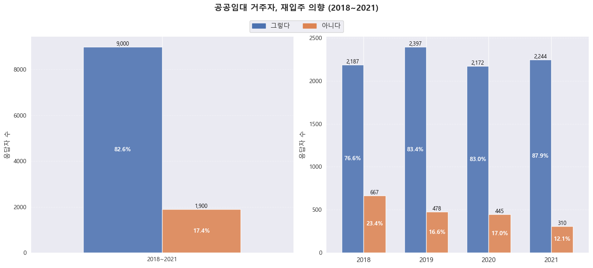

2015년부터 2021년까지, 특히 수도권을 중심으로 주택가격 상승이 이어졌으며 분석 기간인 2018년부터 2021년은 이러한 흐름 속에 포함된다. 따라서 공공임대주택에 거주 중인 가구의 재입주 의향은 가구의 내부 특성뿐 아니라 외부 주택시장 환경의 변화에 의해서도 영향을 받았을 가능성이 있다.

그러나 이 분석은 주거실태조사 자료를 기반으로 가구의 내부 특성에 초점을 두기 때문에, 주택가격 변동이나 거시경제 환경과 같은 외생적 요인을 직접적으로 반영하지 못한다. 외부 시장 자료가 필요한 재입주 의향에 대한 요인 분석은 향후 과제로 남겨 둔다.

---

## 3. 파생변수

기존 설문 문항에 포함된 원변수만으로는 가구의 경제적 여건과 재무구조를 충분히 설명하기 어렵다. 공공임대주택 입주의향은 단순한 소득 수준이나 자산 규모뿐 아니라, 가구가 어떤 방식으로 소득을 얻고 어떤 형태의 자산과 부채를 보유하고 있는지에 따라 다르게 나타날 수 있다. 

이를 확인하고자, 가구의 경제적 포트폴리오와 재무적 부담 수준을 반영할 수 있는 파생변수들을 추가하였다. 
- (1) 소득 대비 주택 임대료 부담
- 주택 점유형태별로 임차비용 구조가 다르다. 전세와 보증금이 있는 월세의 경우, 보증금은 사실상 임차비용의 일부로 기능하므로 이를 월 임대료로 환산한 뒤 경상소득으로 나누어 임대료 부담률을 산출하였다. 
- 전세의 경우 보증금을 전체를 월세로 환산했으며, 보증금이 있는 월세의 경우 보증금 환산액에 실제 월세를 더하여 최종 임대료를 산출하였다. 
- 월세 환산에 사용한 연도별 월세 이율은 [2021년 주거실태조사 요약보고서](https://stat.molit.go.kr/portal/cate/statMetaView.do?hRsId=327)에 제시된 값이다.
- 점유형태가 무상인 경우에는 월세가 발생하지 않으므로, 해당 가구의 임대료 부담률은 0으로 처리하였다.
- 비율 변수 산출 과정에서는 분모가 0일 경우 zero division error가 발생할 수 있다. 이를 방지하기 위해 분모로 사용되는 feature에 0이 있는 경우에는 오류를 방지하기 위해 값을 1로 대체하였다. 예를 들어, 소득 대비 주택 임대로 부담의 경우 경상소득이 이에 해당된다. 
- (2) 소득·자산·부채의 구성비 변수
- 소득, 자산, 부채의 절대 규모뿐 아니라 각 구성항목이 전체에서 차지하는 비중에 주목하였다. 단순 총액 정보만으로는 가구의 재무구조를 충분히 설명하기 어렵기 때문이다. 
- 예를 들어 동일한 총소득을 가진 가구라 하더라도, 근로 및 사업소득 비중이 높은 가구와 정보보조금이나 사적이전소득의 비중이 높은 가구는 소득의 안정성, 정책 의존도, 주거비 부담에 대한 민감도 측면에서 서로 다르게 받아들일 수 있다. 
- 자산 역시 동일한 총자산을 보유하더라도 금융자산 비중이 높은 가구와 부동산 자산 비중이 높은 가구는 자산 유동성 측면에서 차이를 가진다. 
- 부채의 경우 금융기관/비금융기관 대출 중심인지 혹은 임대보증금 중심인지에 따라 가구가 체감하는 재무적 부담과 위험의 성격은 달라질 수 있다. 
- 이에 소득 부문에서는 총소득 대비 ① 근로 및 사업소득의 비중, ② 재산소득의 비중, ③ 사회보험 수혜금의 비중, ④ 정부 보조금의 비중, ⑤ 사적이전소득의 비중
- 자산 부문에서는 총자산 대비 ① 부동산 자산의 비중, ② 금융자산의 비중, ③ 기타자산의 비중
- 부채 부문에서는 총부채 대비 ① 금융기관 대출금의 비중, ② 비금융기관 대출금의 비중, ③ 임대보증금의 비중으로 구성 
- (3) 중기부채부담지표와 장기부채부담지표
- 가구의 부채 부담은 총부채 규모만으로 파악하기 어렵다. 그래서 두 가지 부채부담지표를 추가: ① 중기부채부담지표, ② 장기부채부담지표
- 중기부채부담지표는 총부채를 총 금융자산으로 나눈 값으로, 여러 자산 유형 중 상대적으로 유동성이 높은 금융자산을 활용하여 부채를 상환할 수 있는 능력을 평가하는 지표이다. 이는 단기간에 상환 가능한 부채 수준을 측정함으로써 가구의 유동성 위기 가능성을 판단하는 데 의의가 있다.
- 장기부채부담지표는 총부채를 총자산으로 나눈 값으로, 총자산으로 부채를 청산할 수 있는 능력을 평가하는 지표이다. 총부채와 총자산으로 산출되기 때문에 가구의 전반적인 재무 구조 건전성과 장기적인 파산 위험을 파악할 수 있다. 
- (4) 지출 관련
- 가구의 경제적 제약은 소득뿐만 아니라 지출 측면도 함께 고려할 필요가 있다.
- 이에 생활비를 경상소득으로 나눈 값과, 동절기·간절기·하절기의 주거관리비를 평균한 뒤 이를 경상소득으로 나눈 값을 변수로 추가하였다. 이를 통해 생활비와 주거관리비 부담이 공공임대주택 입주의향과 어떠한 관련을 가지는지 분석하고자 한다.

|  | 변수명 |
|---|---|
| 주거 기본 특성 | 거주 지역 주택 유형 주택 위치 현 주택 거주기간 무주택 기간 점유 형태 주택 구조 주택 면적 이사 횟수 |
| 주거환경 및 만족도 | 생활편의시설 접근성 의료시설 접근성 공공기관 접근성 문화시설 접근성 공원·녹지 접근성 대중교통 접근성 주차 편의성 보행 안전성 교육환경 치안 수준 소음 수준 청결 상태 대기환경 전반적 주택 만족도 |
| 주거이동 및 주거의식 | 이사 계획 시기 이사 계획 사유 희망 거주지역 희망 주택 유형 희망 점유 형태 자가보유 인식 필요 주거지원 프로그램 |
| 가구 및 가구주 특성 | 가구주 연령 가구주 성별 주민등록 등재 여부 실제 동거 여부 장애 여부 가구원 수 교육수준 근무형태 |
| 소득 및 지출 특성 | 기초생활보장 수급 여부 소득계층 소득 대비 임대료 비율 근로·사업소득 비중 재산소득 비중 사회보험 수혜금 비중 정부보조금 비중 사적이전소득 비중 생활비 비중 주거관리비 비중 |
| 자산 및 부채 특성 | 부동산자산 비중 금융자산 비중 기타자산 비중 금융기관 대출 비중 비금융기관 대출 비중 임대보증금 비중 중기부채부담 장기부채부담 |

신혼가구는 출산·가족 형성 단계에 있다는 점을 고려하여, 현재의 자금 상황과 소득 및 소비 수준을 바탕으로 주택 마련까지 예상되는 기간, 부모와의 동거 여부, 가족계획 시 고려하는 요인을 독립변수로 추가하였다. 

부모와의 동거 여부는 남편 또는 아내의 부모와 함께 동거할 계획인지를 물어보는 문항으로, 그 이유로는 주거비나 생활비 등 비용 절감, 육아 및 보육 지원, 그리고 부모 부양 등이 포함된다. 

가족계획 시 중요하게 고려하는 사항에 대해서는 구체적으로 주택 마련, 주거비, 주택 규모 등의 주거 관련 문제, 가계 경제 상황 및 고용 상태, 자녀 양육비와 교육비 부담 등이 포함된다. 

이와 같이 추가된 변수들은 신혼가구가 주거 선택과 가족계획을 결정하는 과정에서 고려하는 경제적·생활적 요인과 가족 자원의 활용 가능성을 보다 종합적으로 반영하기 위한 것이다. 특히 신혼가구는 주거 안정, 가계 경제 상황, 육아 지원 가능성 등이 서로 밀접하게 연결되어 있기 때문에, 이러한 요소들을 함께 고려하는 것이 신혼가구의 주거 관련 의사결정을 설명하는 데 타당하다고 볼 수 있다.

---

## 4. Methodology

  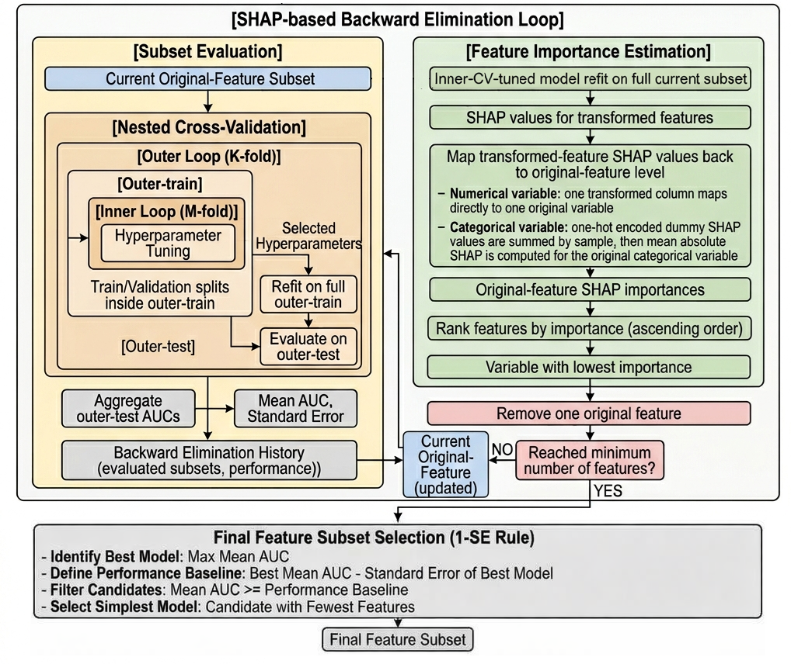

통합공공임대주택 정책 대상 가구 유형별로 입주의향에 영향을 미치는 요인과 그 요인과 입주의향 간의 관계를 확인하기 위해, 먼저 2018년부터 2021년까지의 주거실태조사 자료를 바탕으로 통합공공임대주택 정책 대상 가구를 선별한 다음, 청년, 신혼, 중장년, 고령 가구로 분류한다. 각 유형별 가구 수는 청년 8,444가구, 신혼 6,119가구, 중장년 19,949가구, 고령 10,564가구이다.

종속변수는 공공임대주택 입주의향이며, 독립변수는 기존 공공임대주택 관련 연구에서 주로 활용되어 온 변수들과 3의 파생변수들로 구성된다. 수치형 변수와 범주형 변수가 함께 포함되어 있으며, 수치형 변수는 이상치의 영향을 완화하기 위해 robust scaler를, 범주형 변수는 one-hot encoding을 사용한다.  

일반적인 cross validation (CV)은 데이터를 학습(training)용과 평가(evaluation)용으로 나뉜다. 이때 CV를 이용해 하이퍼파라미터를 튜닝한 후 동일한 평가 데이터셋으로 성능을 측정할 경우, 평가 데이터가 튜닝 과정에 간접적으로 관여하게 된다.

그 결과 해당 데이터에 우연히 잘 맞는 하이퍼파라미터가 선택될 수 있어, 모델 성능이 낙관적으로 편향되어 평가될 가능성이 있다. 즉, unseen data에 대한 실제 성능보다 과대 추정된 결과를 초래할 수 있다. 이 문제를 해결하는 가장 간단한 방법은 train 및 validation set과  완전히 독립된 test set을 사용하여 최종 성능을 평가하는 것이다.

train-validation-test 분할을 통해 하이퍼파라미터 탐색용 데이터와 최종 평가용 데이터를 분리하는 방법도 가능하다. 그러나 신혼가구의 경우 데이터 수가 약 6K이며, 절반 이상의 변수가 범주형 변수로 구성되어 있어 one-hot encoding 적용 후 input feature의 수가 크게 증가하므로, train set이 충분하지 않다.

이러한 문제를 완화하기 위해, 적은 수의 데이터에서도 하이퍼파라미터 탐색과 일반화 성능 평가를 분리하면서 데이터를 최대한 활용할 수 있는 Nested CV를 사용한다. Nested CV는 inner loop와 outer loop로 구성되며 inner loop에서는 하이퍼파라미터 탐색, outer loop에서는 inner loop에서 선택된 모델의 성능을 평가한다.

평가지표로는 AUC를 사용하며, early stopping을 통해 성능 개선이 나타나지 않을 경우 하이퍼파라미터 탐색을 중단하였다. 이렇게 얻어진 outer fold별 AUC를 바탕으로 현재 변수 subset의 평균 AUC와 표준오차를 계산하였다. 이 값은 feature subset 간 상대적 성능 비교를 위한 지표로 활용한다.

최종 목표인 feature subset selection은 SHAP value를 이용한 backward elimination과 1-SE rule을 사용한다.

먼저 현재 변수 subset에 대해 nested CV를 적용하여 성능을 평가한 뒤, 동일한 feature subset 전체 데이터를 사용하여 다시 모델을 학습하였다. 이후 이 모델로 SHAP value를 계산하고, feature importance가 가장 낮은 변수를 하나 제거하였다.

즉, 각 단계마다 현재 subset의 예측 성능은 nested CV로 평가하고, 제거할 변수는 해당 subset 전체 데이터로 학습한 모델의 SHAP value를 이용해 결정하였다. 이는 제거 대상 변수를 성능 평가 결과에 따라 선정하기보다, feature importance를 보다 안정적으로 추정하기 위해 전체 데이터로 학습한 모델의 SHAP value를 활용한 것이다.

범주형 변수는 One-Hot Encoding 이후 여러 개의 더미 변수로 확장되므로, 전처리 후 계산된 SHAP value를 그대로 사용할 경우 원래 범주형 변수의 중요도가 과소평가될 수 있다. 이를 보완하기 위해, 동일한 원변수에서 생성된 더미 변수들의 SHAP value를 샘플별로 먼저 합산한 뒤, 그 절댓값의 평균을 계산하여 원변수 수준의 importance를 산출하였다.

초기 단계에서는 mean absolute SHAP value가 0에 가깝거나 0으로 계산되는 변수들이 다수 나타날 수 있다. 이러한 변수들은 예측에 거의 기여하지 않기 때문에, 제거 순서에 본질적인 차이가 크지 않다. 그래서 제거 방식의 일관성을 위해 importance를 오름차순으로 정렬한 뒤 가장 낮은 변수를 순차적으로 제거한다.

이 과정을 통해 backward elimination path가 생성되면, 최고 평균 AUC를 보인 모델의 평균 AUC에서 그 표준오차를 뺀 값을 기준선으로 설정한 뒤, 이 기준 이상을 만족하는 후보들 가운데 변수 수가 가장 적은 모델을 선택하는 1-SE rule을 적용하여 최종 feature subset을 선택한다. 이를 통해 성능이 최고 수준과 유사하면서도 보다 단순한 모델을 선택한다.

---

## 5. 결과  
아래 그림은 순서대로 청년, 신혼, 중장년, 고령가구에 대한 결과이다. 결과 해석은 변수값과 예측값의 관계가 비교적 분명하게 나타나는 변수에 한정하였다.

  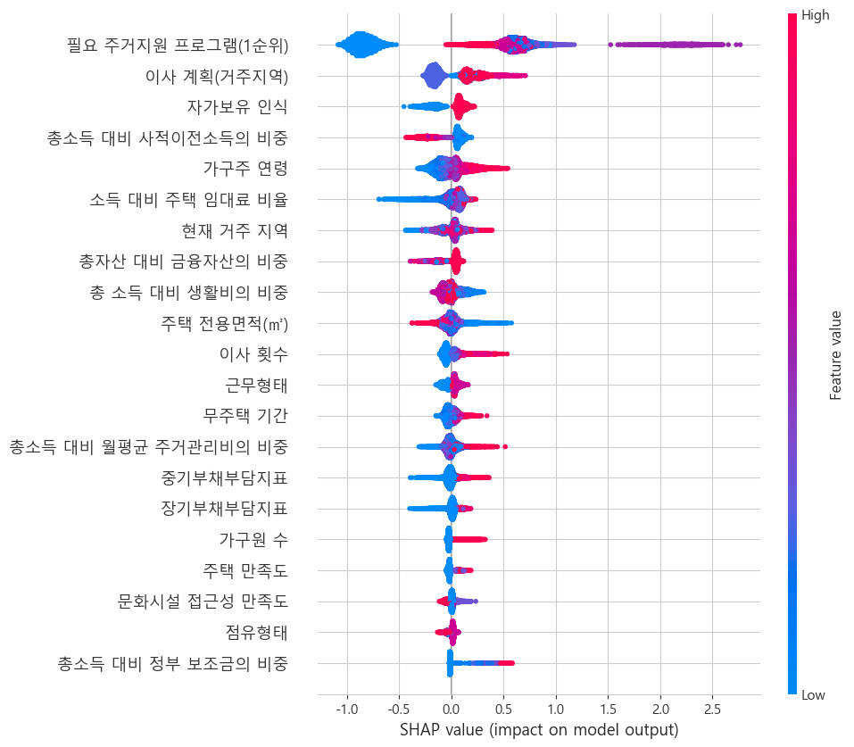
  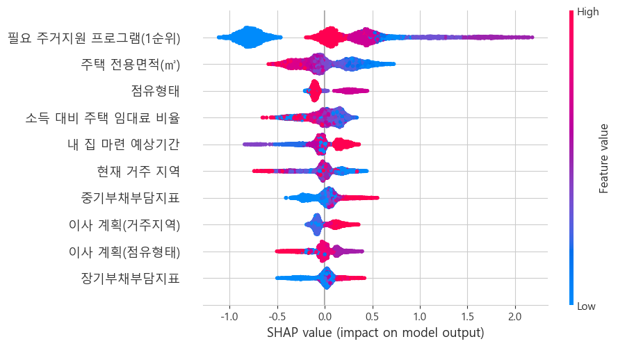
  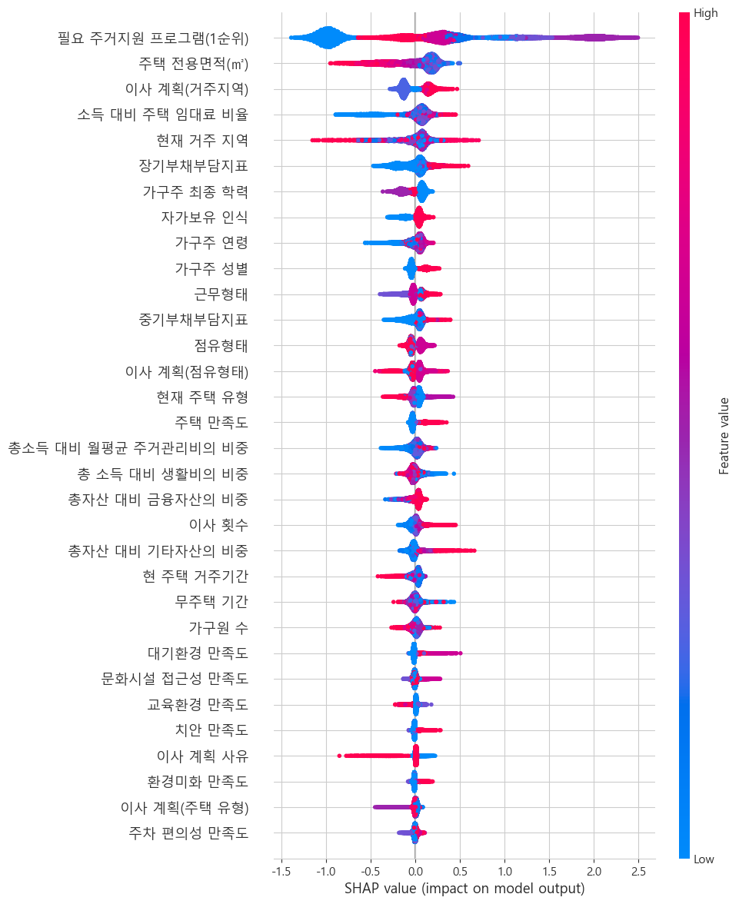
  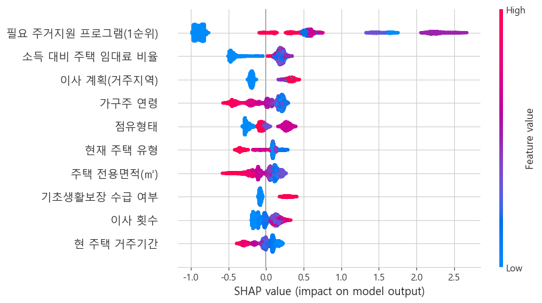

### 5.1 모든 가구 유형에서 공통적으로 나타난 주요 변수
네 가구 유형 모두에서 입주의향에 가장 큰 영향을 미치는 feature는 '필요 주거지원 프로그램(1순위)'인 것을 확인할 수 있다. 이는 공공임대주택 입주의향 예측에서 단순한 현재 주거상태 변수보다, 가구가 어떤 형태의 주거지원을 필요로 인식하는지가 가장 직접적인 신호로 작동했음을 의미한다.

또한 점유형태, 소득 대비 주택 임대료 비율, 이사 계획 관련 변수, 주택 전용면적이 상위 중요 변수로 나타나, 입주의향이 현재의 주거비 부담과 거주 안정성, 그리고 향후 주거이동 계획과 밀접하게 연결되어 있음을 보여준다.

#### 5.1.1 가장 필요한 주거지원 프로그램

  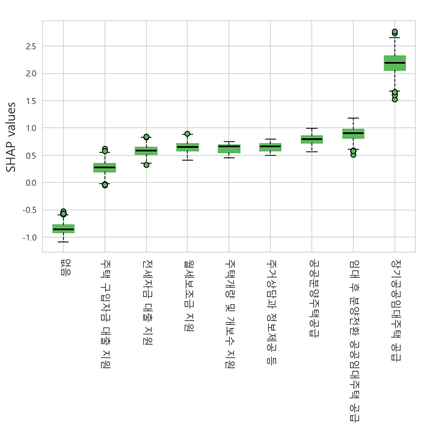
  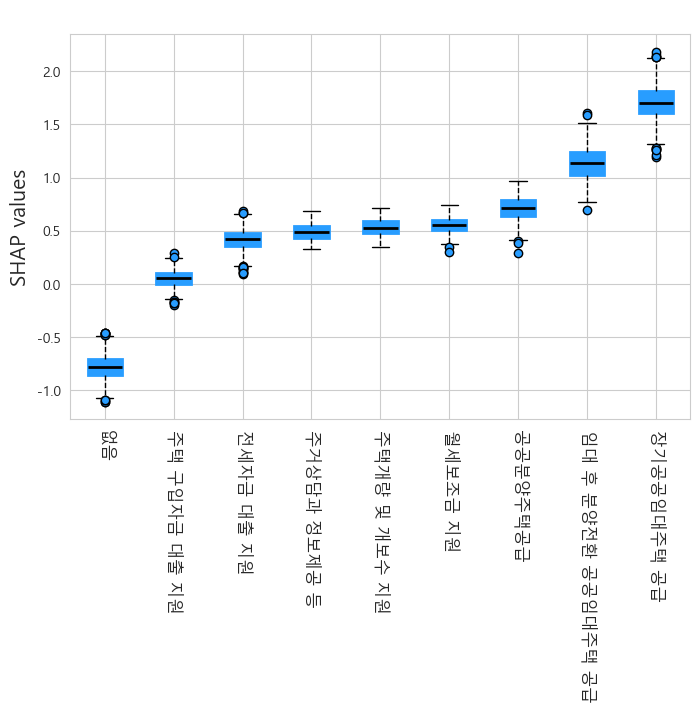
  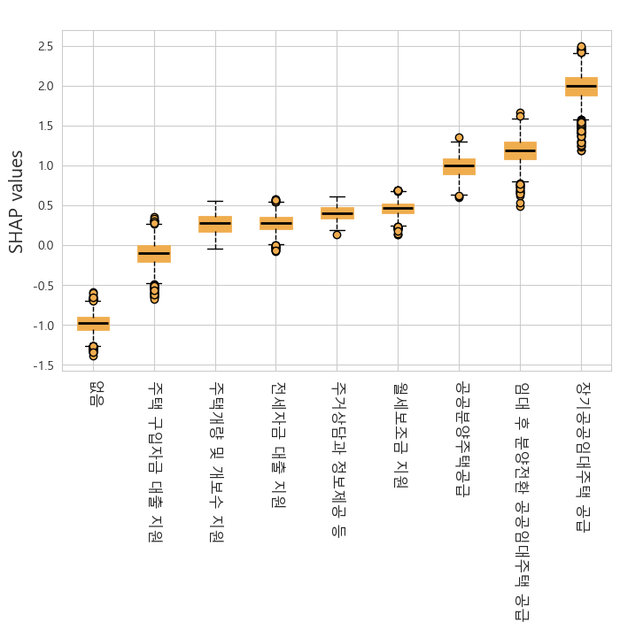
  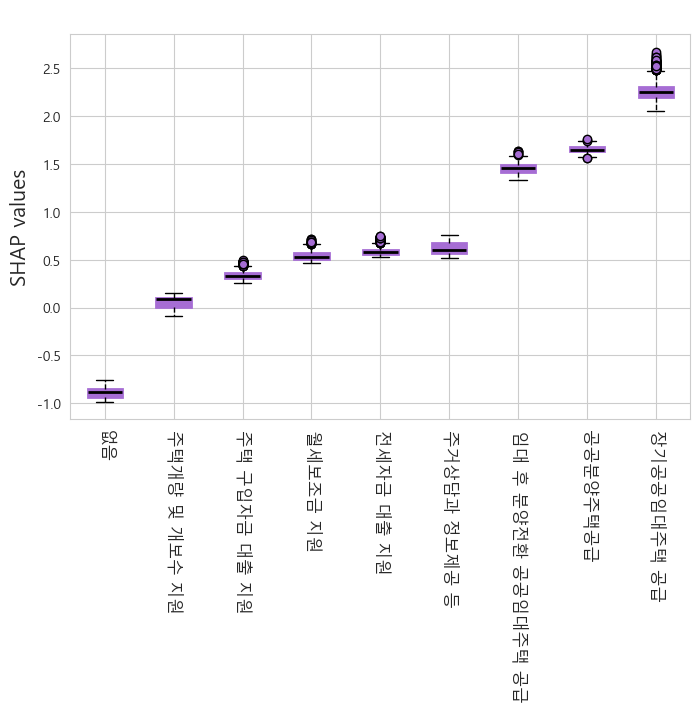

왼쪽부터 차례대로 청년가구, 신혼가구, 중장년가구, 고령가구의 결과이다.

모든 가구 유형에서 장기공공임대주택 공급을 1순위로 선택했을 때 class 1(입주의향 있음) 방향, 반대로 필요한 주거지원 프로그램이 없다고 응답한 가구에서는 class 0(입주의향 없음) 방향의 기여를 보이며, 임대 후 분양전환 공공임대주택 공급과 공공분양주택 공급이 class 1 방향과 연관되어 있는 것을 확인할 수 있다. 이는 공공주택 입주의향이 있는 집단일수록 주거상담이나 단기적 비용 지원(월세 보조금, 주택 구입/전세자금 대출)보다 장기 거주가 가능한 임대 또는 안정적 주거사다리로 기능하는 공공분양·분양전환형 지원을 더 선호하는 경향이 있음을 시사한다.

국토교통부 주거실태조사에 따르면 청년·신혼가구의 가장 필요한 주거지원 프로그램으로는 주택 구입자금 대출과 전세자금 대출이 전반적으로 상위를 차지했으며, 장기공공임대주택 공급은 그보다 낮은 순위에 위치하였다. 이는 동일한 가구 유형이라 하더라도, 전반적인 주거지원 수요와 공공임대주택 입주의향을 설명하는 요인은 서로 다를 수 있음을 보여준다.

#### 5.1.2 이사 계획 지역

  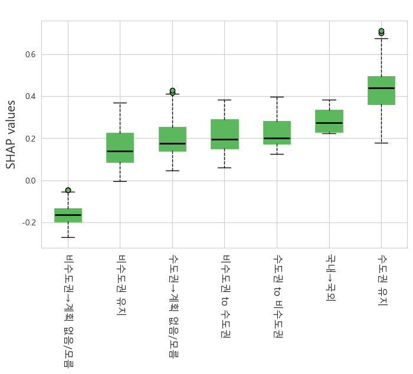
  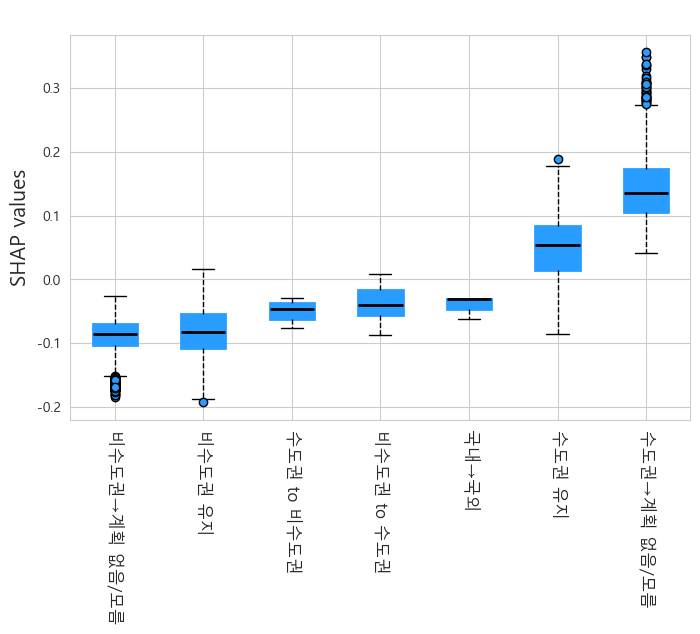
  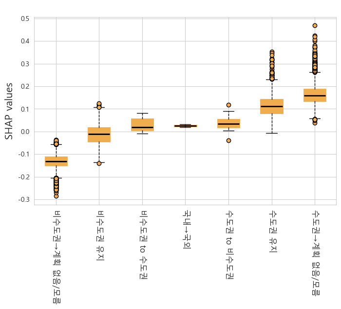
  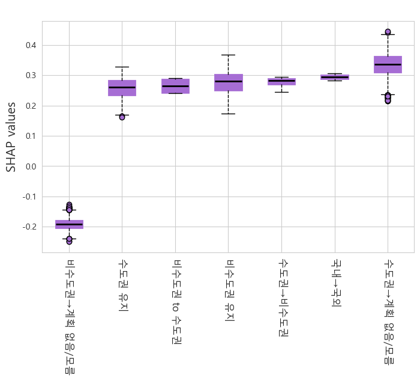

이사 희망 거주지의 경우 비수도권에 거주하면서 이사 계획이 없는 범주는 공통적으로 class 0 방향에 가깝게 나타났고, 반대로 수도권에서 계속 거주할 계획이거나 수도권으로 이동하려는 범주는 class 1 예측에 상대적으로 더 강하게 연결된 것을 볼 수 있다. 통합공공임대주택 정책의 소득기준을 충족하는 가구의 경우 수도권 거주에 대한 선호가 공공임대주택 입주의향과 밀접하게 연결될 수 있음을 시사한다.

#### 5.1.3 주택 임대료
2018~2021년 주거실태조사에서 공공임대주택 거주가구는 매년 공통적으로 '저렴한 임대료'를 가장 중요한 만족 이유로 응답하였다. 즉, 임대료 부담은 공공임대주택의 핵심 효용인 저렴한 임대료와 직접 연결되는 변수이다.

이러한 점을 전제로 볼 때, 통합공공임대주택 정책의 소득요건을 충족하는 중장년가구에서는 임대료 부담이 높을수록 class 1 방향의 기여가 가장 뚜렷하게 나타나, 주거비 절감 수요가 공공임대주택 입주의향으로 직접 연결되는 집단으로 해석할 수 있다. 이는 중장년가구가 경제적 압박이 큰 가구 생애주기에 위치한다는 점과도 관련될 수 있다.

반면 청년가구와 고령가구에서는 임대료 부담이 높을 때의 class 1 기여보다, 부담이 낮을 때 class 0 방향의 기여가 더 뚜렷하게 나타났다. 청년가구의 경우 사적이전소득 비중이 높을수록 class 0 예측이 뚜렷하게 나타난 점을 고려하면, 부모 등으로부터의 지원이 임대료 부담을 일정 부분 완충하여 입주의향을 약화시킬 가능성이 있다. 고령가구의 경우에는 소득 활동이 많지 않아 상대적으로 주거비 부담이 크더라도, 익숙한 주거환경을 유지하려는 성향으로 인해 주거이동 자체에 소극적일 가능성이 있다. 주거실태조사에서 고령가구의 주거 이동률이 10%대에 머무른다는 결과를 고려하면, 임대료 부담이 낮을 경우 현재 주거지에 계속 거주하려는 성향이 더욱 강화될 가능성이 있다.

한편 신혼가구에서는 오히려 낮은 임대료 부담이 class 1 방향과 연결되는 경향이 나타났다. 다만 class 1 방향으로의 기여도가 크지 않다는 점에서, 청약이나 자가 마련 등 다른 주거 선택지 역시 함께 고려되고 있을 가능성이 있다. 이러한 결과는 공공임대주택을 단순한 비용 절감 수단으로 보기보다, 더 나은 주거 환경(육아, 넓은 평수 등)이나 장기적 주거 안정성을 위한 대안으로 인식할 가능성을 시사한다.

#### 5.1.4 주택 면적
주택 전용면적은 모든 가구유형에서 비교적 일관된 방향성을 보인다. 전반적으로 현재 거주 주택의 면적이 넓을수록 class 0, 좁을수록 class 1 방향의 기여가 나타났다. 가구유형별로 보면, 청년과 신혼가구에서는 주택 면적이 작을수록 class 1 방향의 기여가 상대적으로 뚜렷하게 나타난 반면, 중장년과 고령가구에서는 주택 면적이 넓을수록 class 0 방향의 기여가 보다 분명하게 관찰되었다. 이는 청년과 신혼가구가 상대적으로 협소한 주거환경에 놓여 있을 가능성이 높고, 따라서 주택 규모의 제약이 공공임대주택 입주의향으로 더 직접적으로 연결될 수 있음을 시사한다. 반면 중장년과 고령가구에서는 이미 일정 수준의 주거 규모를 확보한 경우 현재 주거를 유지하려는 경향이 더 강하게 나타난 것으로 볼 수 있다. 이는 2018~2021년 주거실태조사에서 청년·신혼가구의 주거면적이 일반가구보다 지속적으로 좁게 나타난 결과와도 방향상 부합한다.

#### 5.1.5 점유형태

  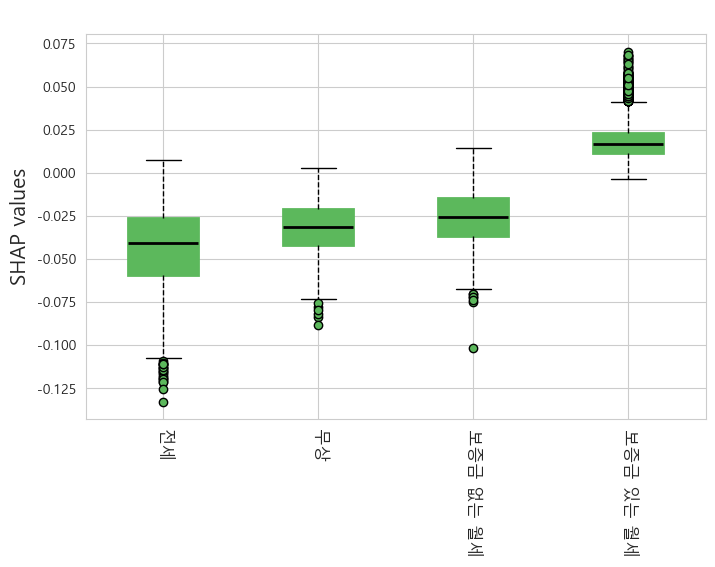
  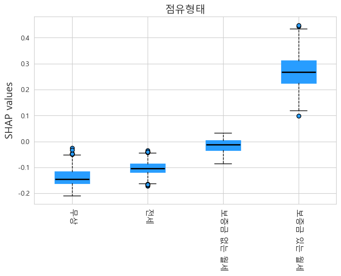
  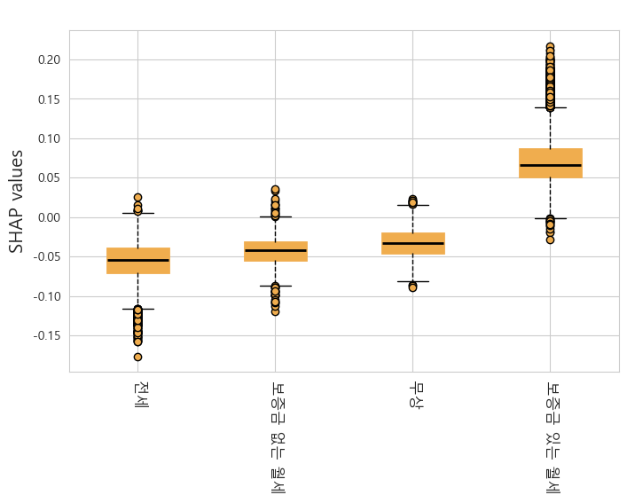
  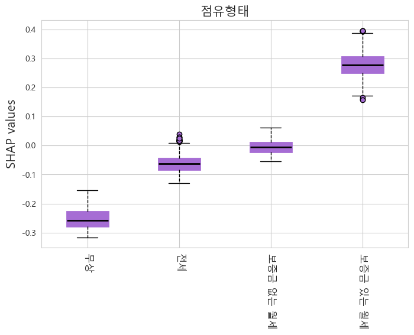

점유형태는 모든 가구유형에서 보증금 있는 월세만 class 1 방향과 가장 가깝게 나타났고, 전세·자가·무상은 상대적으로 반대 방향의 기여를 보였다. 이러한 결과는 2020년 주거실태조사에서 공공임대주택 입주의향이 월세 거주 가구에서 가장 높고, 전세·자가 순으로 낮아진 결과와 방향상 부합한다. 또한 2018~2021년 주거실태조사에서 공공임대주택 거주가구가 가장 만족하는 이유로 일관되게 '저렴한 임대료'를 선택했다는 점을 고려하면, 월세 계열 점유형태는 공공임대주택의 핵심 효용과 가장 직접적으로 연결되는 점유형태라고 볼 수 있다.

### 5.2 일부 가구 유형에서 공통적으로 나타난 주요 변수

#### 5.2.1 자가보유 인식

  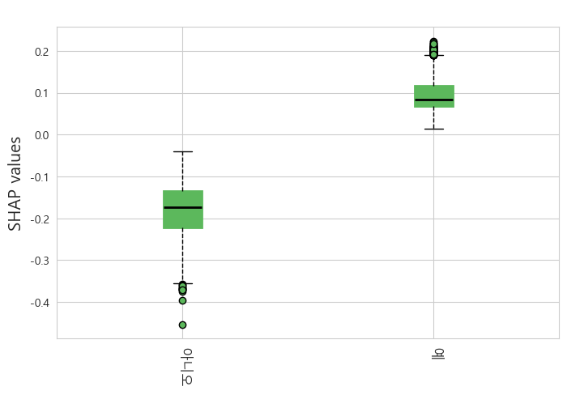
  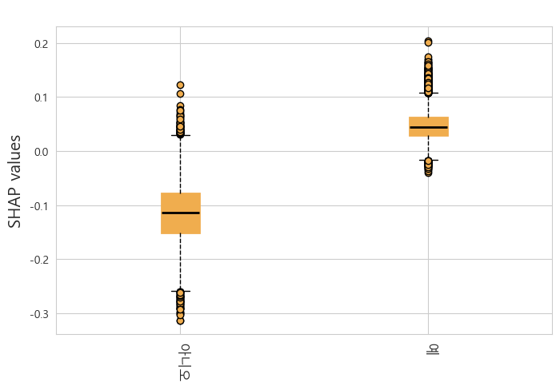

자가보유 인식은 청년과 중장년가구 각각 3번째, 8번째로 큰 중요도를 보였다. 두 가구유형 모두에서 '내 집이 있어야 한다'라고 인식하는 범주는 class 1 방향의 기여를, 그렇지 않은 범주는 class 0 방향의 기여를 나타냈다. 이는 공공임대주택 입주의향이 주거 안정성에 대한 요구가 강한 집단에서 현실적인 대안으로 인식될 수 있음을 시사한다. 청년의 경우 자가 보유는 독립의 완성이자 자산 형성의 시작점, 중장년층은 가족 부양과 노후 안정을 위한 성격이 강하다. 반면 신혼가구는 결혼을 통해 소득과 자산을 합치게 되고, 정부 지원이 집중되어 있고 고령가구는 자산 축적과 노후 준비 단계를 상당 부분 거친 실질적으로 노후 생활 단계에 있는 집단으로, 자가보유에 대한 인식이 있더라도 그것이 새로운 주거 선택으로 작용하기보다 현재의 주거를 유지하려는 성향과 결합될 가능성이 있다.

#### 5.2.2 근무형태

  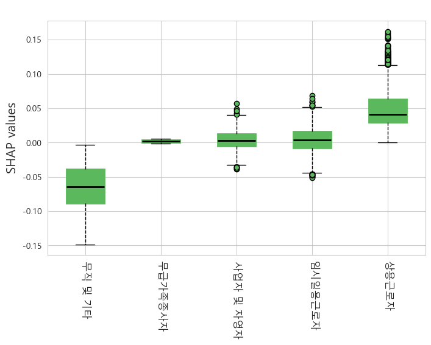
  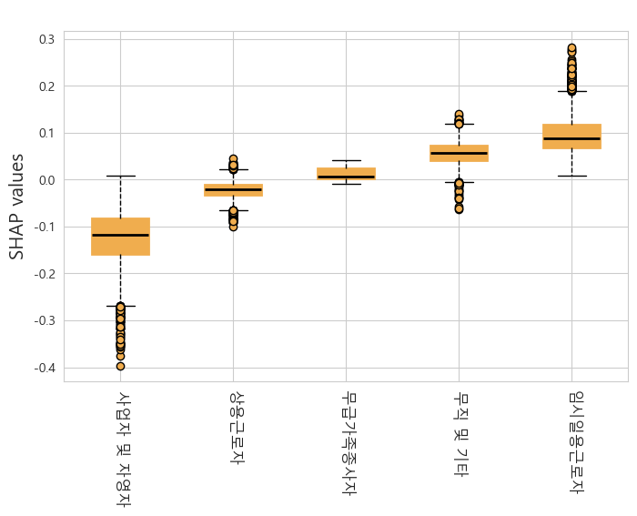

청년가구에서는 상대적으로 상용근로자가 class 1 방향에, 무직·기타는 class 0 방향에 가깝게 나타났다. 반면 중장년가구에서는 임시·일용근로자가 class 1 방향에, 사업·자영업자는 class 0 방향에 상대적으로 가깝게 나타났다. 통합공공임대주택 일반공급의 소득기준이 기준 중위소득 150% 이하라는 점을 고려하면, 청년가구의 경우 안정적인 고용 기반을 가진 집단일수록 주거를 향후 독립과 주거 상향 이동을 준비하는 과정으로 인식하며, 공공임대주택을 그 과정의 현실적인 대안으로 고려할 가능성이 있다. 한편 중장년가구의 경우에는 부모부양, 자녀양육, 노후준비가 중첩되는 생애단계에 놓여 있고 노동시장 불안정성에도 노출될 수 있다는 점에서, 임시·일용근로와 같이 고용 안정성이 낮은 집단일수록 공공임대주택을 주거비 절감을 통해 생활 불안을 완충하는 현실적 대안으로 인식하였을 가능성이 있다.

#### 5.2.3 주거관리비 
주거관리비의 경우 청년가구는 부담이 높을수록 class 1, 중장년가구는 부담이 낮을수록 class 0 방향으로의 기여가 나타난 것을 볼 수 있다. 이는 공공임대주택의 효용이 임대료뿐 아니라 관리비를 포함한 전체 주거비 부담 경감과도 연결될 수 있음을 시사한다.

#### 5.2.4 생활비 
생활비의 경우 청년가구와 중장년가구에서 공통적으로 의미 있는 방향성을 보였다. 두 가구유형 모두에서 소득에서 생활비가 차지하는 비중이 낮을수록 class 1 방향, 높을수록 class 0 방향의 기여가 나타났다.

#### 5.2.5 현재 거주지
현재 거주지는 청년·신혼·중장년가구에서 공공임대주택 입주의향을 구분하는 변수로 나타났으나, 이를 특정 지역 그 자체의 효과로 해석하는 것은 적절하지 않다. 해당 지역의 주택시장 여건, 가구유형 분포 등이 함께 반영된 결과일 가능성이 있기 때문이다.

#### 5.2.6 이사 횟수

이사 횟수는 청년·중장년·고령가구에서 공통적으로 의미 있는 방향성을 보인 변수이다. 이사 횟수가 많을수록 class 1, 적을수록 class 0 방향의 기여가 나타났다. 다만 약간의 차이가 있다. 청년·중장년에서는 이사 횟수가 많을수록 class 1 예측이 높아지는 경향이 뚜렷했는데, 주거실태조사에서 고령가구의 주거 이동률이 가장 낮게 나타난다는 점을 고려하면, 이는 잦은 이주 경험이 주거 안정성의 저하와 연결되며 공공임대주택을 현실적인 대안으로 인식하게 했을 가능성을 시사한다. 반면 고령가구에서는 이사 횟수가 적을수록 class 0 예측이 두드러졌는데, 현재 주거를 유지하려는 성향이 강하게 반영된 결과로 해석할 수 있다.

#### 5.2.7 중기부채부담지표
중기부채부담지표는 총부채를 금융자산으로 나눈 값으로, 가구가 보유한 유동성 자산을 활용해 부채를 상환할 수 있는지를 보여주는 지표이다. 청년·신혼·중장년가구 모두에서 이 지표가 높을수록 class 1 방향의 기여가, 낮을수록 class 0 방향의 기여가 나타났다. 이는 당장 활용 가능한 금융자산 대비 부채 부담이 클수록, 즉 단기·중기적 유동성 압박이 심할수록 공공임대주택이 보다 현실적인 주거 대안으로 인식될 가능성을 시사한다.

#### 5.2.8 장기부채부담지표
장기부채부담지표는 총부채를 총자산으로 나눈 값으로, 가구의 장기적 재무안정성과 자산 대비 부채 부담 정도를 보여주는 지표이다. 신혼·중장년가구에서 이 지표가 높을수록 class 1 방향의 기여가, 낮을수록 class 0 방향의 기여가 비교적 분명하게 나타났다. 반면 청년가구에서는 장기부채부담지표의 양(+) 방향성이 상대적으로 약하게 나타났는데, 이는 청년층의 경우 장기적 자산구조보다 당장 활용 가능한 금융자산 대비 부채 부담, 즉 유동성 압박이 입주의향에 더 직접적으로 연결되었을 가능성을 보여준다.

#### 5.2.9 가구주 연령

#### 5.2.10 현재 주택 유형

#### 5.2.11 현 주택 거주기간

### 5.3 특정 가구 유형에서 두드러지게 나타난 주요 변수
5.1과 5.2에서 살펴본 공통적으로 나타난 변수 외에, 각 가구 유형에서 중요도가 높거나 뚜렷한 방향성을 보인 변수는 다음과 같다.

#### 5.3.1 청년 - 사적이전소득의 비중, 무주택 기간, 가구원 수

#### 5.3.2 신혼 - 내 집 마련 예상기간

#### 5.3.3 중장년 - 가구주 최종 학력, 가구주 성별, 기타자산의 비중

#### 5.3.4 고령 - 기초생활보장 수급 여부

---

## 6. 한계
첫째, SHAP은 각 feature가 모델 예측에 얼마나 기여했는지를 보여주지만, 그 변수가 공공임대주택 입주의향을 인과적으로 변화시킨다는 뜻은 아니다. 즉, 공공임대주택 입주의향 구조를 이해하기 위한 탐색적 근거로 활용하되, 인과적 해석과 일반화에는 신중할 필요가 있다. 그리고 교육수준, 성별, 현재 거주 지역, 주택유형과 같은 변수는, 변수 자체의 효과라기보다 소득, 자산, 점유형태, 가구구성, 지역시장 여건 등이 반영된 결과일 가능성이 크다. 그러므로 변수간 상호작용을 확인한다면, 이러한 관계가 어떤 조건에서 달라지는지 더 구체적으로 파악할 수 있을 것이다. 

둘째, 2018~2021년 자료를 통합해 분석하였기 때문에, 결과는 여러 시기에 걸친 평균적 경향으로 해석해야 한다. 해당 기간은 집값이 가파르게 상승한 시기로 주택가격, 전세시장, 금리, 코로나19, 정부 주거정책 등 외부 환경의 변화가 매우 컸다. 그러므로 동일한 변수라도 2018년과 2021년 사이에 의미가 달라졌을 가능성이 있다. 연도별 구조 차이를 반영하지 않았기 때문에 연도별 변동이나 특정 시기의 특수성까지 설명하는 데에는 한계가 있다.

셋째, 상관된 변수들 사이에서 SHAP 기여가 나뉘는 문제가 있다. 예를 들어 임대료, 관리비, 생활비 부담 그리고 부채부담지표나 자산비중 변수들은 서로 구조적으로 연결되어 있다. 이런 경우 서로 겹치는 정보를 가진 변수들 사이에서 SHAP 기여가 나뉘어 나타날 수 있다.
